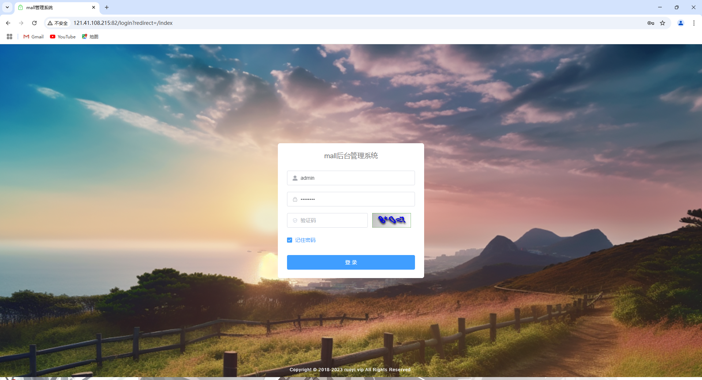
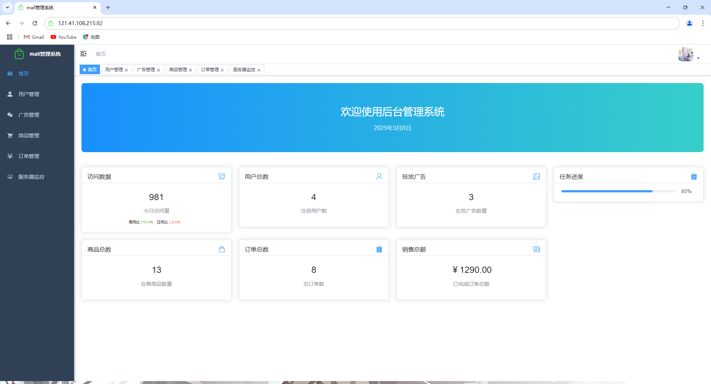
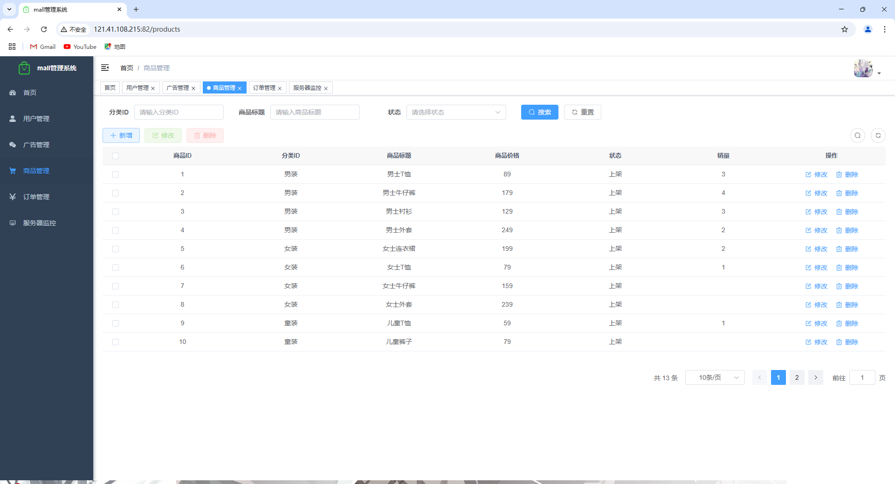
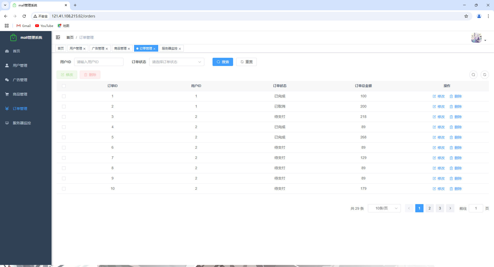
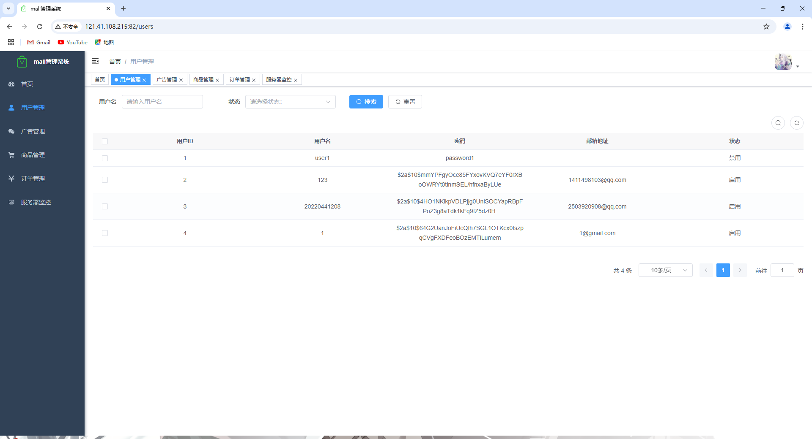
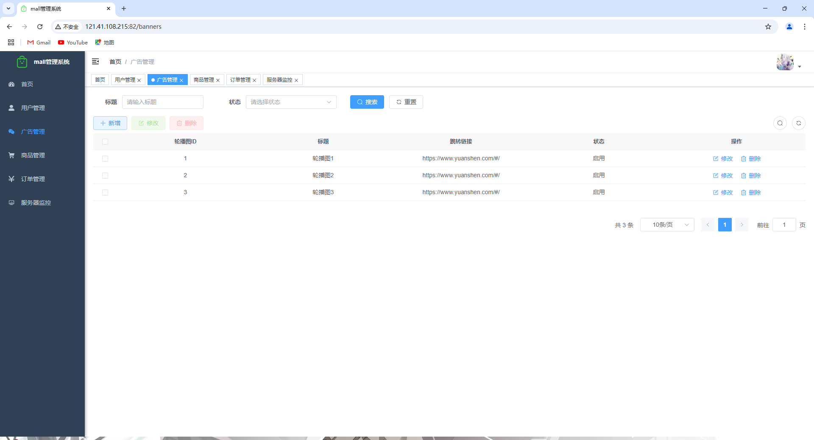
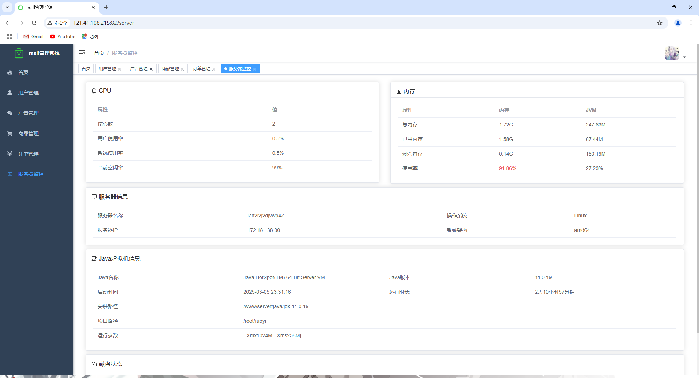

# 商城后台管理系统前端项目

## 项目介绍

本项目是基于 RuoYi-Vue3 框架开发的后台管理系统前端部分，提供了完整的电商管理功能，包括商品管理、订单管理、用户管理、广告管理等模块。系统采用现代化的设计风格，操作简便，功能强大。

## 技术栈

- **前端框架**：Vue 3
- **UI 组件库**：Element Plus
- **状态管理**：Vuex/Pinia
- **路由管理**：Vue Router
- **HTTP 请求**：Axios
- **图标库**：@element-plus/icons-vue
- **CSS 预处理器**：SCSS
- **构建工具**：Vite

## 功能模块

### 登录界面



### 首页仪表盘
- 数据概览：访问数据、用户总数、商品总数、订单总数等关键指标

- 实时数据更新：系统自动每30秒刷新访问数据

  

### 商品管理
- 商品列表展示

- 商品分类管理

- 商品上架/下架

- 商品详情编辑

  

### 订单管理
- 订单列表查询

- 订单状态跟踪

- 订单详情查看

- 销售额统计

  

### 用户管理
- 用户信息管理

- 用户权限设置

- 用户行为分析

  

### 广告管理
- 广告内容管理

- 广告位置设置

- 广告上线/下线控制

  

### 服务器管理


## 功能演示

### 首页仪表盘
首页提供了系统的核心数据概览，包括：
- 今日访问量及同比增长率
- 注册用户总数
- 在售商品数量
- 订单总数
- 销售总额
- 在投广告数量
- 任务进度

### 数据实时刷新
系统会自动每30秒刷新访问数据，确保管理员能够实时了解网站流量情况。访问数据包括今日访问量、周同比和日同比增长率，直观展示网站流量趋势。

### 响应式设计
系统采用响应式设计，适配不同尺寸的屏幕，确保在桌面端和平板设备上都能获得良好的使用体验。

## 安装与使用

### 环境要求
- Node.js >= 16.0.0
- npm >= 7.0.0

### 安装步骤
```bash
# 克隆项目
git clone [项目地址]

# 进入项目目录
cd RuoYi-Vue3-master

# 安装依赖
npm install

# 启动开发服务器
npm run dev

# 构建生产环境
npm run build
```

### 配置说明
项目的主要配置文件位于：
- `.env.development`：开发环境配置
- `.env.production`：生产环境配置

可根据实际需求修改API接口地址等配置项。

## 项目预览

项目演示地址：[http://121.41.108.215:82/](http://121.41.108.215:82/)

（网址打开不了就是服务器到期了ξ( ✿＞◡❛)，希望大家尽量不要进行修改删除操作，谢谢大家的配合(´・ω・`)。若数据遭到恶意修改删除请联系管理员QQ:1411498103）

## 许可证

本项目使用 MIT 许可证 - 详情请参阅 [LICENSE](LICENSE) 文件
